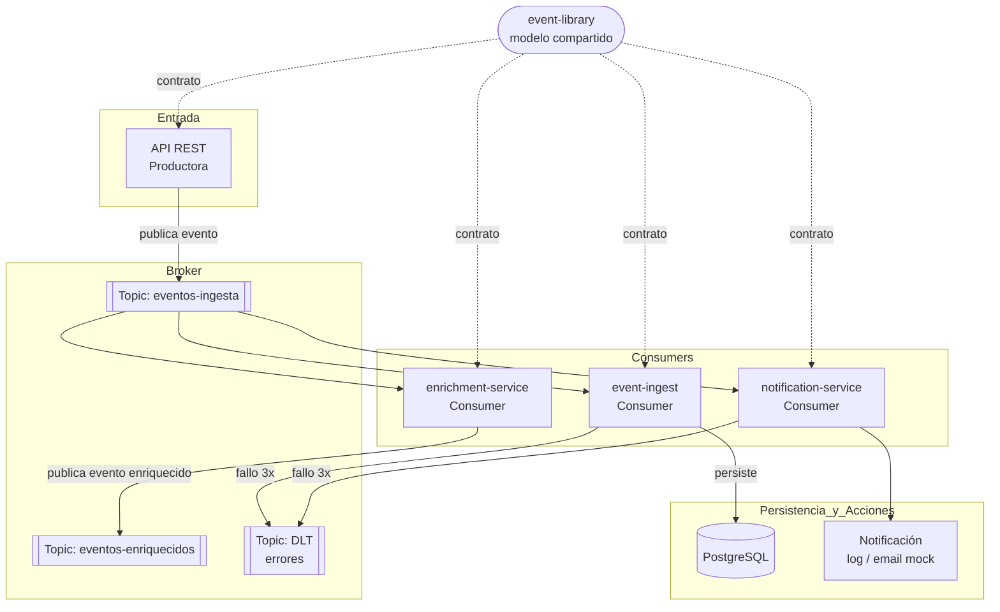

# kafka-eventdriven-platform – Programa FCT

## 1. Objetivo del programa

Este programa tiene como finalidad desarrollar, en un entorno cercano a la consultoría real, un conjunto de sistemas distribuidos basados en arquitectura event-driven utilizando:

* Java 21
* Spring Boot 3.x
* Maven (proyecto multi-módulo)
* Apache Kafka

El objetivo no es únicamente implementar código funcional, sino entender:

* Cómo se diseñan sistemas desacoplados
* Cómo fluyen los datos en entornos reales
* Cómo se gestionan errores, escalabilidad y trazabilidad

---

## 2. Prerrequisitos del alumno

Nivel mínimo esperado para comenzar el programa:

* Java básico-intermedio (clases, interfaces, colecciones, excepciones)
* Algo de experiencia con Spring Boot (controllers REST, inyección de dependencias)
* Familiaridad con Maven (dependencias, ciclo de vida)
* Git (commits, ramas, pull requests)

No se requiere experiencia previa con Kafka ni con arquitecturas distribuidas.

---

## 3. Entorno de desarrollo

| Herramienta     | Versión mínima |
|-----------------|----------------|
| Java (JDK)      | 21             |
| Spring Boot     | 3.2.x          |
| Maven           | 3.9.x          |
| Docker Desktop  | 4.x            |
| IDE             | IntelliJ IDEA Community / VS Code |

El entorno de Kafka y PostgreSQL se levanta con Docker Compose (incluido en el módulo `infra/`).

---

## 4. Estructura del repositorio

El proyecto es un **multi-módulo Maven** bajo un único repositorio:

```
kafka-eventdriven-platform/
├── pom.xml                    ← POM padre (dependencyManagement)
├── infra/                     ← Docker Compose (Kafka, ZooKeeper, PostgreSQL única)
├── event-library/             ← Contrato de eventos compartido (BaseEvent + tipos)
├── domain-service/            ← CRUD de negocio: pedidos, productos, clientes
├── event-ingest/              ← Consumer: trazabilidad y persistencia de eventos
├── notification-service/      ← Consumer: notificaciones asíncronas
├── enrichment-service/        ← Consumer + Producer: enriquecimiento de datos
├── monitoring-service/        ← (stretch) métricas y observabilidad
└── anomaly-detector/          ← (stretch) detección de anomalías
```

> El diseño completo del sistema, el contrato de eventos, los schemas SQL y la estrategia de cambio de sector están documentados en [diseno-sistema.md](diseno-sistema.md).

---

## 5. Separación de responsabilidades

El sistema se divide en dos componentes independientes:

| Componente | Módulos | Quién | ¿Cambia al cambiar de sector? |
|---|---|---|---|
| **Domain Layer** | `domain-service` + frontend | Alumno (API) + Tutor (Frontend) | ✅ Sí |
| **Event Pipeline** | `event-library`, `event-ingest`, `notification-service`, `enrichment-service` | Alumno | ❌ No |

Esta separación garantiza que si el sistema evoluciona de ecommerce a banca (por ejemplo), el Event Pipeline completo es reutilizable sin cambios. Solo varía el módulo de dominio y el frontend.

---

## 6. Enfoque de trabajo

Se desarrollará un ecosistema progresivo de servicios conectados entre sí, simulando un entorno empresarial real.

Cada módulo aporta una pieza al sistema global.

---

## 7. Proyectos a desarrollar

Los proyectos se dividen en **core** (obligatorios) y **stretch goals** (opcionales si el tiempo lo permite).

### Core

#### 7.1 Librería interna de eventos ⭐ *(punto de partida)*

**Objetivo:**
Definir el contrato de datos compartido por todos los módulos.

**Módulo Maven:** `event-library`

**Componentes:**

* `BaseEvent` con campos: `eventId`, `eventType`, `occurredAt`, `publishedAt`, `source`, `correlationId`, `version`
* Eventos de dominio tipados: `OrderCreatedEvent`, `OrderStatusChangedEvent`, `ProductUpdatedEvent`
* Utilidades de serialización JSON

**Conceptos clave:**

* Contrato estable antes de implementar
* Herencia y type-safety en eventos
* Versionado de contratos

**Definición de done:**
- `BaseEvent` y subtipos compilan e importan correctamente desde otros módulos
- Tests unitarios de serialización/deserialización

---

#### 7.2 Servicio de dominio *(API principal del sistema)*

**Objetivo:**
Gestionar el negocio (pedidos, productos, clientes) y publicar eventos ante cada cambio de estado.

**Módulo Maven:** `domain-service`

**Componentes:**

* API REST CRUD: productos, clientes, pedidos
* Publicación de eventos a Kafka tras cada operación de escritura
* Persistencia en schema `domain` de PostgreSQL (Flyway)

**Conceptos clave:**

* Separación dominio / eventos
* Transaccionalidad: el evento solo se publica si el CRUD persiste correctamente
* Unit price inmutable en `order_items` (precio en el momento del pedido)

**Definición de done:**
- CRUD completo de productos, clientes y pedidos con validaciones
- Cada creación/actualización/cancelación publica el evento correspondiente en Kafka
- Tests de integración del flujo completo (CRUD → evento publicado)

---

#### 7.3 Ingesta y trazabilidad de eventos

**Objetivo:**
Centralizar y persistir todos los eventos que fluyen por el sistema.

**Módulo Maven:** `event-ingest`

**Componentes:**

* Consumer Kafka del topic `domain.events`
* Persistencia en schema `events` de PostgreSQL
* Gestión de idempotencia por `eventId`
* Dead Letter Topic para mensajes fallidos

**Conceptos clave:**

* Idempotencia
* Consumo desacoplado
* Dead Letter Topic (DLT)
* Trazabilidad por `correlationId` 

**Definición de done:**
- El consumer persiste cada evento sin duplicados
- Los mensajes fallidos (3 intentos) van al DLT y se persisten en `events.dead_letter`
- Tests de integración con Kafka embebido (Testcontainers)

---

#### 7.4 Notificaciones asíncronas

**Objetivo:**
Reaccionar a eventos y generar notificaciones sin bloquear el flujo principal.

**Módulo Maven:** `notification-service`

**Componentes:**

* Consumer Kafka del topic `domain.events`
* Servicio de notificación (log + mock email)
* Retry con backoff exponencial

**Conceptos clave:**

* Procesamiento asíncrono
* Retry con backoff
* Separación de responsabilidades

**Definición de done:**
- El consumer reacciona a `ORDER_CREATED` y genera notificación
- Retry configurado y probado con fallos simulados
- Resultado persistido en `events.notifications`
- Tests unitarios del servicio de notificación

---

#### 7.5 Enriquecimiento de datos

**Objetivo:**
Añadir información adicional a los eventos y republicarlos para consumo downstream.

**Módulo Maven:** `enrichment-service`

**Componentes:**

* Consumer Kafka del topic `domain.events`
* Consulta a la DB de dominio para datos adicionales
* Publicación del evento enriquecido en `domain.events.enriched`

**Conceptos clave:**

* Transformación de datos en pipeline
* Join lógico entre eventos y base de datos
* Versionado de eventos

**Definición de done:**
- El evento enriquecido contiene campos adicionales verificables (ej: nombre del cliente en un evento que solo tenía su ID)
- Resultado persistido en `events.event_enrichments`
- Tests unitarios de la lógica de enriquecimiento

---

### Stretch goals *(si el tiempo lo permite)*

#### 7.6 Monitorización de eventos

**Objetivo:**
Medir el comportamiento del sistema con métricas reales.

**Módulo Maven:** `monitoring-service`

**Componentes:**

* Micrometer + Spring Boot Actuator
* API de consulta de métricas

**Conceptos clave:**

* Observabilidad
* SLAs

---

#### 7.7 Detección de anomalías

**Objetivo:**
Identificar comportamientos inusuales en el flujo de eventos.

**Módulo Maven:** `anomaly-detector`

**Componentes:**

* Consumer analítico
* Generación de alertas por reglas y ventanas temporales

**Conceptos clave:**

* Reglas de negocio sobre streams
* Ventanas temporales

---

## 7. Arquitectura global

Todos los proyectos estarán conectados mediante Kafka como backbone principal.

Flujo general:



Principios:

* Desacoplamiento
* Asincronía
* Escalabilidad
* Tolerancia a fallos

---

## 8. Metodología de trabajo (Scrum adaptado)

### 8.1 Estructura

* Sprints semanales
* Entregable funcional por sprint
* Evolución incremental

### 8.2 Ceremonias

**Sprint Planning**

* Definición de objetivos
* División en tareas

**Daily (ligero)**

* Progreso
* Bloqueos

**Sprint Review**

* Demo funcional del módulo completado

**Retrospectiva**

* Mejora continua

### 8.3 Criterio de done general

Un sprint se considera completado cuando:

1. El código compila y los tests pasan
2. La funcionalidad está demostrable (no solo "en local funciona")
3. El módulo está integrado en el POM padre
4. Se ha hecho commit con un mensaje descriptivo

---

## 9. Roadmap (4 semanas)

### Semanas 1–2

* Setup del entorno y verificación de versiones
* Levantar Kafka + PostgreSQL con Docker Compose
* Crear estructura multi-módulo Maven
* Implementar `event-library` (módulo 7.1)
* Primer producer/consumer funcional con `domain-service`

### Semanas 3–4

* Módulo `event-ingest` (7.3): pipeline completo con persistencia
* Dead Letter Topic
* Consistencia transaccional en `domain-service` (`@Transactional` + publicación síncrona)
* Tests de integración básicos
* Demo final ante el tutor

### Stretch goals *(si el ritmo lo permite)*

* Módulo `notification-service` (7.4)
* Módulo `enrichment-service` (7.5)
* Outbox Pattern como evolución de la consistencia transaccional
* Módulos avanzados (7.6, 7.7)

---

## 10. Guion reunión inicial (1h)

### 1. Contexto (10 min)

* Qué es consultoría
* Qué problema resuelven estos sistemas

### 2. Visión de proyectos (15 min)

* Explicación de todos los bloques y su relación
* Estructura del repo multi-módulo

### 3. Arquitectura (10 min)

* Event-driven
* Kafka como backbone
* Flujo de datos entre módulos

### 4. Metodología (15 min)

* Scrum adaptado
* Sprints y criterio de done
* Forma de trabajar (commits, demos, dailys)

### 5. Roadmap (5–7 min)

* Qué se hará cada semana
* Qué son core vs stretch goals

### 6. Expectativas (5 min)

* Enfoque en entender, no solo ejecutar

---

## 11. Resultado esperado

Al finalizar el programa:

* Comprensión de arquitectura distribuida y event-driven
* Experiencia realista de trabajo en consultoría
* Capacidad de construir y conectar servicios con Kafka
* Hábito de testear, versionar y documentar el código

---

## 12. Principios clave

* Pensar antes de codificar
* Diseñar antes de implementar
* Entender el flujo de datos
* Priorizar claridad sobre complejidad

---

## 13. Nota final

Este programa está diseñado para simular un entorno profesional real, donde el foco está en resolver problemas de negocio mediante tecnología, no en construir ejercicios aislados.
