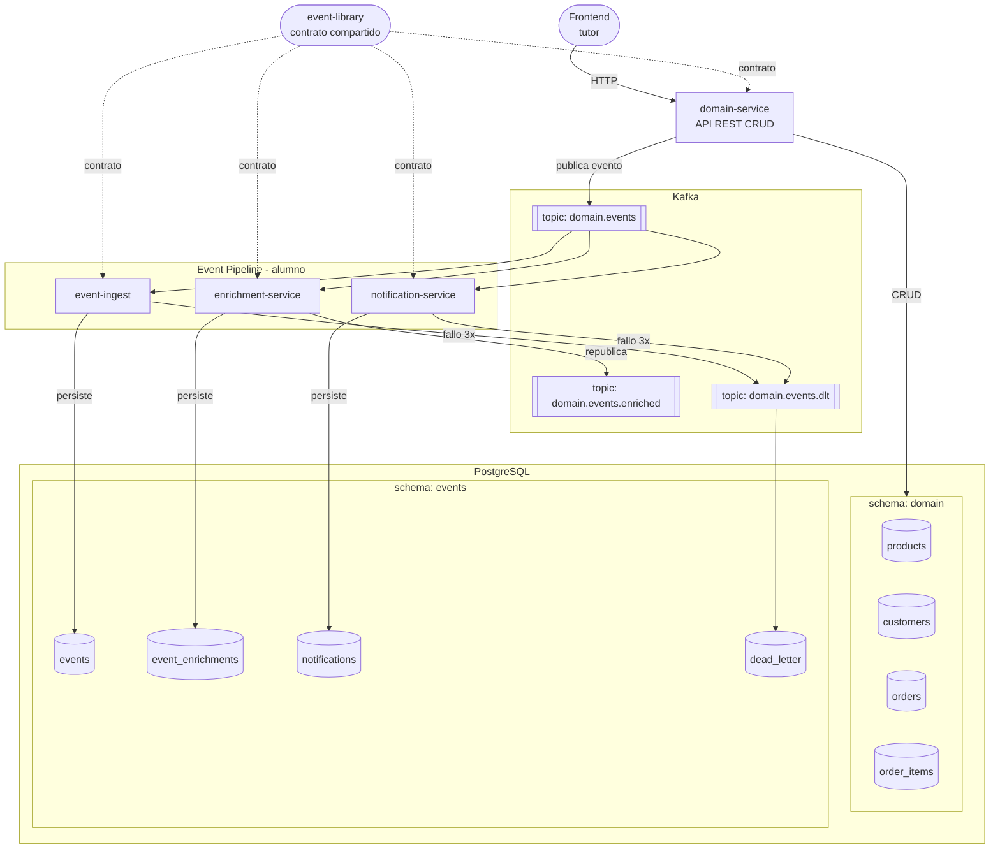

# Diseño del Sistema – kafka-eventdriven-platform

## 1. Visión arquitectónica

El sistema está dividido en **dos componentes independientes** que pueden evolucionar por separado:

| Componente | Qué es | Quién lo implementa | Cambia al cambiar de sector |
|---|---|---|---|
| **Domain Layer** | CRUD de negocio + publicación de eventos | Alumno (API) + Tutor (Frontend) | ✅ Sí |
| **Event Pipeline** | Procesamiento, persistencia y reacción a eventos | Alumno | ❌ No |

> **Clave de diseño:** Si mañana este sistema fuera para banca, `orders` y `products` se convertirían en `transactions` y `accounts`, pero `event-ingest`, `notification-service` y `enrichment-service` no cambiarían una sola línea. El contrato de eventos (`BaseEvent`) es el punto de estabilidad.

---

## 2. Flujo completo del sistema



---

## 3. Responsabilidades por módulo

### `event-library` — Alumno
Librería Maven sin Spring Boot. Solo modelos y utilidades.
- `BaseEvent` y subtipos de eventos de dominio
- Serialización / deserialización JSON
- Sin lógica de negocio

### `domain-service` — Alumno (API) + Tutor (Frontend)
Spring Boot. La API que el frontend consume.
- CRUD completo: productos, clientes, pedidos
- Al crear/actualizar/cancelar un pedido → publica evento a Kafka
- Lee y escribe sobre el schema `domain` de PostgreSQL
- **Es el único módulo que cambia al cambiar de sector**

### `event-ingest` — Alumno
Consumer Kafka. Trazabilidad de todos los eventos.
- Consume de `domain.events`
- Persiste cada evento en `events.events` con su payload completo
- Gestiona idempotencia por `eventId`
- Los mensajes fallidos van al DLT

### `notification-service` — Alumno
Consumer Kafka. Reacción asíncrona a eventos.
- Consume de `domain.events`
- Genera notificaciones (log por ahora, mock de email)
- Retry con backoff exponencial
- Persiste en `events.notifications`

### `enrichment-service` — Alumno
Consumer + Producer Kafka. Transformación de datos.
- Consume de `domain.events`
- Enriquece con datos de la DB de dominio (precios actuales, stock, etc.)
- Publica evento enriquecido a `domain.events.enriched`
- Persiste en `events.event_enrichments`

---

## 4. Contrato de eventos (`event-library`)

### 4.1 BaseEvent

```java
public abstract class BaseEvent {
    UUID    eventId;        // idempotencia — generado por domain-service
    String  eventType;      // ej: "ORDER_CREATED", "PRODUCT_UPDATED"
    Instant occurredAt;     // cuándo ocurrió el hecho de negocio
    Instant publishedAt;    // cuándo se envió a Kafka (lo pone la librería)
    String  source;         // nombre del módulo productor, ej: "domain-service"
    UUID    correlationId;  // hilo que une todos los eventos de una operación
    String  version;        // "v1" — para evolución del contrato
}
```

### 4.2 Eventos de dominio (ecommerce)

#### `OrderCreatedEvent extends BaseEvent`
```java
// eventType = "ORDER_CREATED"
UUID   orderId;
UUID   customerId;
String customerEmail;
List<OrderItemDto> items;   // { productId, productName, quantity, unitPrice }
BigDecimal totalAmount;
String status;              // siempre "PENDING" en creación
```

#### `OrderStatusChangedEvent extends BaseEvent`
```java
// eventType = "ORDER_STATUS_CHANGED"
UUID   orderId;
String previousStatus;
String newStatus;           // VALIDATED | PAID | CONFIRMED | CANCELLED
String reason;              // motivo del cambio, especialmente en CANCELLED
```

#### `ProductUpdatedEvent extends BaseEvent`
```java
// eventType = "PRODUCT_UPDATED"
UUID       productId;
String     productName;
String     changedField;    // "price" | "stock" | "status"
String     previousValue;
String     newValue;
```

#### `NotificationDispatchedEvent extends BaseEvent`
```java
// eventType = "NOTIFICATION_DISPATCHED"  — producido por notification-service
UUID   originalEventId;     // FK al evento que lo disparó
String notificationType;    // "EMAIL" | "LOG" | "WEBHOOK"
String recipient;
String status;              // "SENT" | "FAILED"
int    attemptCount;
```

#### `EventEnrichedEvent extends BaseEvent`
```java
// eventType = "EVENT_ENRICHED"  — producido por enrichment-service
UUID               originalEventId;
Map<String,Object> enrichedFields;
String             enrichmentSource; // "domain-db" | "external-api"
```

---

## 5. Base de datos — Schema `domain`

> Gestionado por `domain-service` via Flyway/Liquibase

```sql
-- =============================================
-- SCHEMA: domain
-- =============================================
CREATE SCHEMA IF NOT EXISTS domain;

-- Clientes
CREATE TABLE domain.customers (
    id           UUID PRIMARY KEY DEFAULT gen_random_uuid(),
    name         VARCHAR(150)        NOT NULL,
    email        VARCHAR(255)        NOT NULL UNIQUE,
    phone        VARCHAR(20),
    address      JSONB,
    created_at   TIMESTAMPTZ         NOT NULL DEFAULT now(),
    updated_at   TIMESTAMPTZ         NOT NULL DEFAULT now()
);

-- Productos
CREATE TABLE domain.products (
    id           UUID PRIMARY KEY DEFAULT gen_random_uuid(),
    name         VARCHAR(200)        NOT NULL,
    description  TEXT,
    price        NUMERIC(10,2)       NOT NULL CHECK (price >= 0),
    stock        INTEGER             NOT NULL DEFAULT 0 CHECK (stock >= 0),
    category     VARCHAR(100),
    status       VARCHAR(20)         NOT NULL DEFAULT 'ACTIVE'
                     CHECK (status IN ('ACTIVE', 'INACTIVE', 'OUT_OF_STOCK')),
    created_at   TIMESTAMPTZ         NOT NULL DEFAULT now(),
    updated_at   TIMESTAMPTZ         NOT NULL DEFAULT now()
);

-- Pedidos
CREATE TABLE domain.orders (
    id             UUID PRIMARY KEY DEFAULT gen_random_uuid(),
    customer_id    UUID            NOT NULL REFERENCES domain.customers(id),
    status         VARCHAR(20)     NOT NULL DEFAULT 'PENDING'
                       CHECK (status IN ('PENDING','VALIDATED','PAID','CONFIRMED','CANCELLED')),
    total_amount   NUMERIC(10,2)   NOT NULL CHECK (total_amount >= 0),
    notes          TEXT,
    created_at     TIMESTAMPTZ     NOT NULL DEFAULT now(),
    updated_at     TIMESTAMPTZ     NOT NULL DEFAULT now()
);

-- Líneas de pedido
CREATE TABLE domain.order_items (
    id           UUID PRIMARY KEY DEFAULT gen_random_uuid(),
    order_id     UUID           NOT NULL REFERENCES domain.orders(id) ON DELETE CASCADE,
    product_id   UUID           NOT NULL REFERENCES domain.products(id),
    quantity     INTEGER        NOT NULL CHECK (quantity > 0),
    unit_price   NUMERIC(10,2)  NOT NULL CHECK (unit_price >= 0), -- precio en el momento del pedido
    subtotal     NUMERIC(10,2)  GENERATED ALWAYS AS (quantity * unit_price) STORED
);

-- Índices
CREATE INDEX ON domain.orders(customer_id);
CREATE INDEX ON domain.orders(status);
CREATE INDEX ON domain.order_items(order_id);
CREATE INDEX ON domain.order_items(product_id);
```

---

## 6. Base de datos — Schema `events`

> Gestionado por `event-ingest` (tabla base), cada servicio crea sus propias tablas

```sql
-- =============================================
-- SCHEMA: events
-- =============================================
CREATE SCHEMA IF NOT EXISTS events;

-- Registro central de todos los eventos procesados
CREATE TABLE events.events (
    id               UUID PRIMARY KEY,          -- = BaseEvent.eventId
    event_type       VARCHAR(100)    NOT NULL,
    source           VARCHAR(100)    NOT NULL,
    correlation_id   UUID,
    version          VARCHAR(10)     NOT NULL DEFAULT 'v1',
    occurred_at      TIMESTAMPTZ     NOT NULL,
    published_at     TIMESTAMPTZ     NOT NULL,
    processed_at     TIMESTAMPTZ     NOT NULL DEFAULT now(),
    status           VARCHAR(20)     NOT NULL DEFAULT 'PROCESSED'
                         CHECK (status IN ('PROCESSED', 'FAILED')),
    payload          JSONB           NOT NULL
);

CREATE INDEX ON events.events(event_type);
CREATE INDEX ON events.events(correlation_id);
CREATE INDEX ON events.events(occurred_at);
CREATE INDEX events_payload_gin ON events.events USING GIN (payload);

-- Enriquecimientos producidos por enrichment-service
CREATE TABLE events.event_enrichments (
    id                 UUID PRIMARY KEY DEFAULT gen_random_uuid(),
    original_event_id  UUID         NOT NULL REFERENCES events.events(id),
    enrichment_source  VARCHAR(100) NOT NULL,
    enriched_fields    JSONB        NOT NULL,
    created_at         TIMESTAMPTZ  NOT NULL DEFAULT now()
);

CREATE INDEX ON events.event_enrichments(original_event_id);

-- Notificaciones producidas por notification-service
CREATE TABLE events.notifications (
    id                 UUID PRIMARY KEY DEFAULT gen_random_uuid(),
    event_id           UUID         NOT NULL REFERENCES events.events(id),
    notification_type  VARCHAR(20)  NOT NULL CHECK (notification_type IN ('EMAIL','LOG','WEBHOOK')),
    recipient          VARCHAR(255),
    status             VARCHAR(20)  NOT NULL CHECK (status IN ('SENT','FAILED')),
    attempt_count      INTEGER      NOT NULL DEFAULT 1,
    error_detail       TEXT,
    created_at         TIMESTAMPTZ  NOT NULL DEFAULT now(),
    last_attempt_at    TIMESTAMPTZ  NOT NULL DEFAULT now()
);

CREATE INDEX ON events.notifications(event_id);
CREATE INDEX ON events.notifications(status);

-- Dead Letter: mensajes que han fallado definitivamente
CREATE TABLE events.dead_letter (
    id              UUID PRIMARY KEY DEFAULT gen_random_uuid(),
    original_topic  VARCHAR(200)  NOT NULL,
    event_type      VARCHAR(100),
    raw_payload     JSONB         NOT NULL,   -- mensaje Kafka tal cual llegó
    error_message   TEXT          NOT NULL,
    attempt_count   INTEGER       NOT NULL,
    created_at      TIMESTAMPTZ   NOT NULL DEFAULT now(),
    resolved        BOOLEAN       NOT NULL DEFAULT false,
    resolved_at     TIMESTAMPTZ,
    resolution_note TEXT
);

CREATE INDEX ON events.dead_letter(resolved);
CREATE INDEX ON events.dead_letter(original_topic);
```

---

## 7. Topics de Kafka

| Topic | Productor | Consumidores | Retención |
|---|---|---|---|
| `domain.events` | `domain-service` | `event-ingest`, `notification-service`, `enrichment-service` | 7 días |
| `domain.events.enriched` | `enrichment-service` | *(stretch: monitoring, anomaly)* | 7 días |
| `domain.events.dlt` | Spring Kafka (auto) | manual / monitoring | 30 días |

---

## 8. Cómo cambia el sistema al cambiar de sector

**Ecommerce → Banca**

| Elemento | Ecommerce | Banca | ¿Cambia? |
|---|---|---|---|
| Schema `domain` | orders, products, customers | transactions, accounts, clients | ✅ Sí |
| `domain-service` API | CRUD pedidos/productos | CRUD transacciones/cuentas | ✅ Sí |
| Eventos publicados | `ORDER_CREATED`, `PRODUCT_UPDATED` | `TRANSACTION_INITIATED`, `ACCOUNT_UPDATED` | ✅ Sí (nombres) |
| `BaseEvent` estructura | id, type, occurredAt, source... | **igual** | ❌ No |
| `event-ingest` | consume y persiste | **igual** | ❌ No |
| `notification-service` | consume y notifica | **igual** | ❌ No |
| `enrichment-service` | consume y enriquece | **igual** | ❌ No |
| Schema `events` | events, notifications, dlt... | **igual** | ❌ No |

El **Event Pipeline completo** es reutilizable sin cambios. Solo el módulo de dominio y el frontend varían.

---

## 9. Estructura final del repositorio

```
kafka-eventdriven-platform/
├── pom.xml                      ← POM padre
├── infra/
│   └── docker-compose.yml       ← Kafka, ZooKeeper, PostgreSQL (única instancia)
├── event-library/               ← BaseEvent + eventos de dominio tipados
├── domain-service/              ← CRUD API (pedidos, productos, clientes)
│   └── src/main/resources/
│       └── db/migration/        ← Flyway: schema domain
├── event-ingest/                ← Consumer: trazabilidad y persistencia
│   └── src/main/resources/
│       └── db/migration/        ← Flyway: schema events (tablas base)
├── notification-service/        ← Consumer: notificaciones asíncronas
├── enrichment-service/          ← Consumer + Producer: enriquecimiento
├── monitoring-service/          ← (stretch) métricas
├── order-service/               ← (stretch) flujo completo de pedido
└── anomaly-detector/            ← (stretch) detección de anomalías
```
---

## 10. Consistencia transaccional en `domain-service`

### El problema

Cuando `domain-service` crea un pedido, realiza dos operaciones en sistemas distintos:

```
1. INSERT INTO domain.orders (...)   → PostgreSQL ✅
2. kafkaTemplate.send(...)           → Kafka       ❌ (puede fallar)
```

Si Kafka no está disponible en el momento de la publicación, el pedido queda persistido en la DB pero **ningún consumer se entera**. El sistema queda en un estado inconsistente silenciosamente.

### Progresión de soluciones a lo largo del proyecto

#### Fase 1 — Semanas 1–2: Fire and forget *(aceptar el riesgo intencionalmente)*

```java
orderRepository.save(order);
kafkaTemplate.send("domain.events", event); // si falla, el error se loguea pero no se propaga
```

**Por qué:** el alumno aprende el flujo sin fricción. En local con Docker, Kafka casi nunca falla.  
**Objetivo pedagógico:** que el alumno descubra el problema por sí mismo al simular un fallo de Kafka.

---

#### Fase 2 — Semanas 3–4: `@Transactional` + publicación síncrona *(solución adoptada para el proyecto)*

```java
@Transactional
public Order createOrder(OrderRequest request) {
    Order order = orderRepository.save(order);
    try {
        kafkaTemplate.send("domain.events", event).get(); // .get() = síncrono, espera ACK de Kafka
    } catch (Exception e) {
        throw new RuntimeException("Kafka unavailable — rolling back order", e); // rollback automático
    }
    return order;
}
```

**Por qué:** si Kafka falla, la transacción hace rollback del INSERT. Ni el pedido ni el evento quedan a medias.  
**Trade-off asumido:** la llamada `.get()` hace la publicación síncrona, perdiendo parte de la asincronía de Kafka (la API tarda tanto como Kafka en confirmar). Es un coste aceptable para el scope del proyecto.  
**Objetivo pedagógico:** `@Transactional` con un caso real que justifica su uso, y entender el coste de la consistencia.

---

#### Fase 3 — Stretch goal (post semana 4): Outbox Pattern *(solución de producción)*

En vez de publicar directamente a Kafka:

```sql
-- Nueva tabla en schema domain
CREATE TABLE domain.outbox (
    id          UUID PRIMARY KEY DEFAULT gen_random_uuid(),
    event_type  VARCHAR(100) NOT NULL,
    payload     JSONB        NOT NULL,
    status      VARCHAR(20)  NOT NULL DEFAULT 'PENDING
                    CHECK (status IN ('PENDING', 'SENT', 'FAILED')),
    created_at  TIMESTAMPTZ  NOT NULL DEFAULT now(),
    sent_at     TIMESTAMPTZ
);
```

```java
@Transactional
public Order createOrder(OrderRequest request) {
    Order order = orderRepository.save(order);
    outboxRepository.save(new OutboxEntry(event)); // misma transacción → atomicidad garantizada
    return order;
}

// Proceso separado (scheduler cada N segundos)
@Scheduled(fixedDelay = 5000)
public void processOutbox() {
    outboxRepository.findByStatus("PENDING").forEach(entry -> {
        kafkaTemplate.send("domain.events", entry.toEvent());
        entry.setStatus("SENT");
        outboxRepository.save(entry);
    });
}
```

**Por qué:** el INSERT en `domain.orders` y el INSERT en `domain.outbox` son atómicos (misma transacción, misma DB). El poller publica a Kafka de forma independiente, con reintentos si falla.  
**Es el patrón real** utilizado en sistemas de producción (Uber, Netflix, cualquier banco mediano).  
**Objetivo pedagógico:** entender por qué existe el patrón y qué problema resuelve que la Fase 2 no resuelve completamente.

### Resumen de decisiones

| Semanas | Estrategia | Consistencia | Asincronía | Complejidad |
|---|---|---|---|---|
| 1–2 | Fire and forget | ❌ No garantizada | ✅ Total | Mínima |
| 3–4 | `@Transactional` + `.get()` | ✅ Garantizada | ⚠️ Perdida en publicación | Baja |
| Stretch | Outbox Pattern | ✅ Garantizada | ✅ Total | Media |